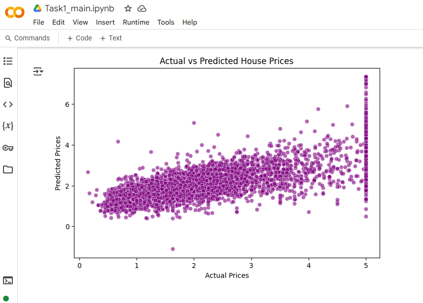

# SCT-ML-1
# 🏡 Task 1 - House Price Prediction using Linear Regression

This project is part of my Machine Learning Internship with **SkillCraft Technology**.  
I built a **Linear Regression** model to predict house prices using the **California Housing Dataset** from Scikit-learn.

---

## 📌 Technologies Used
- Python (Google Colab)
- Pandas & NumPy
- Scikit-learn (Linear Regression, Train-Test Split, Evaluation Metrics)
- Matplotlib & Seaborn (Data Visualization)

---

## 📊 Dataset
The **California Housing** dataset includes:
- `MedInc` - Median Income
- `HouseAge` - Age of the House
- `AveRooms` - Average Number of Rooms
- `AveBedrms` - Average Number of Bedrooms
- `Population`
- `AveOccup` - Average Occupancy
- `Latitude`, `Longitude`
- `MedHouseVal` - Median House Value (**Target**)

---

## 📈 Model Performance

- ✅ **Mean Squared Error (MSE):** ~0.657
- ✅ **R² Score:** ~0.498
- ✅ No null values in dataset
- ✅ Scatter plot for Actual vs Predicted Prices

---

## 📷 Output Visualization

  
*Replace with actual screenshot if available*

---

## 🚀 Author
**👩‍💻 Keerthana Dinesh**  
Machine Learning Intern | [[LinkedIn](https://www.linkedin.com/in/keerthanadinesh95/)]

---

## ⭐ GitHub Repo
🔗 [Click to view the code](https://github.com/keerthanadinesh95/SCT_ML_1)

